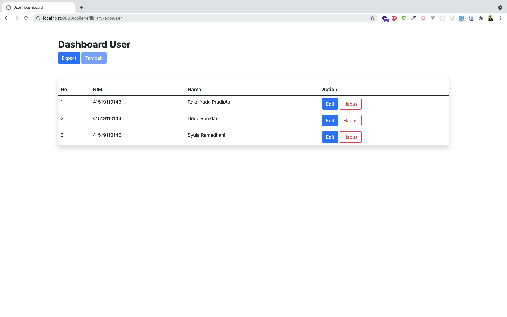
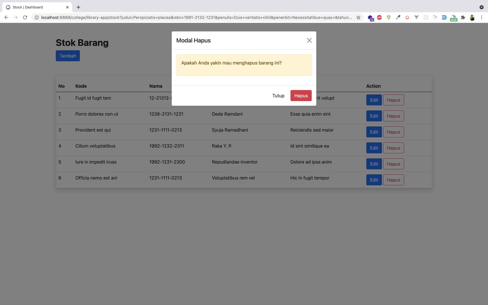
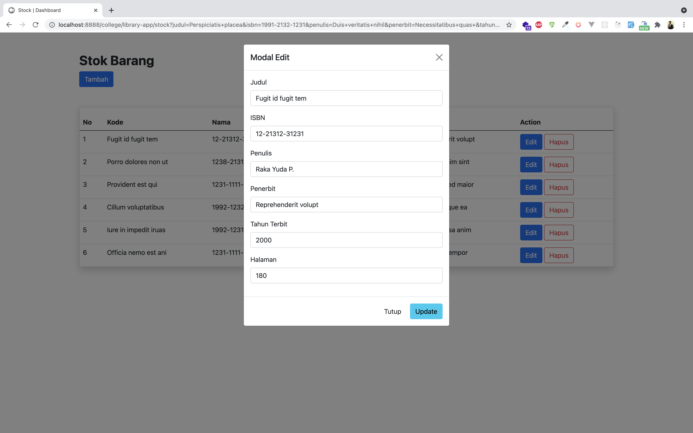
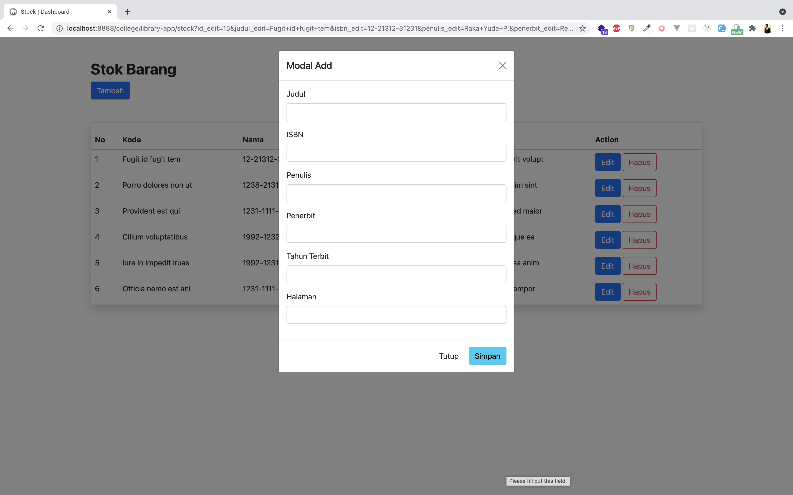
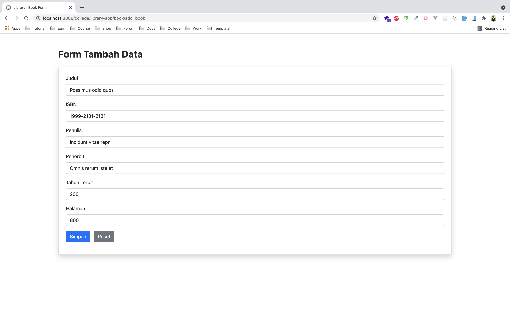
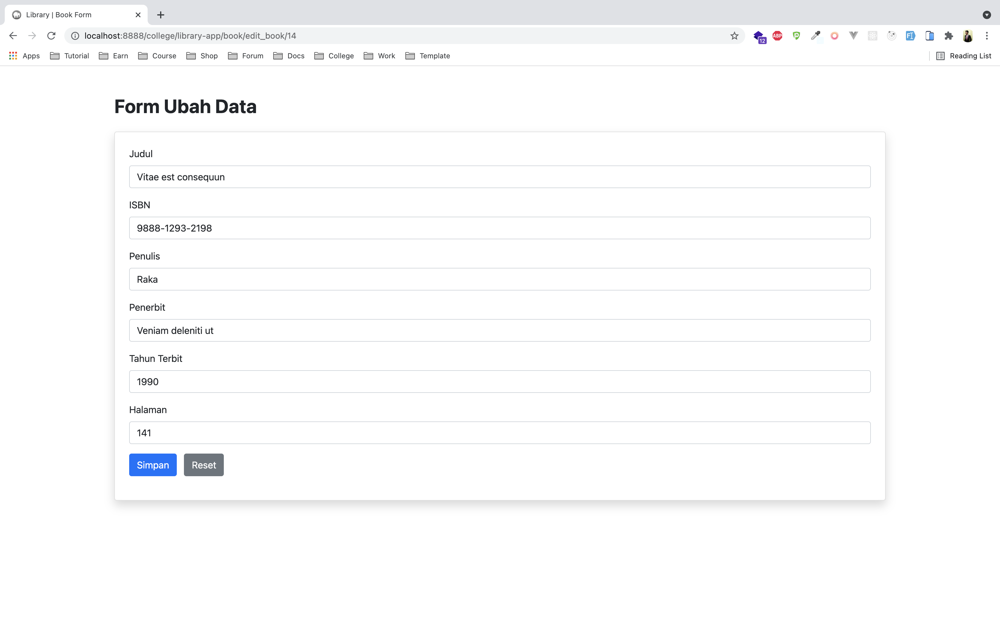
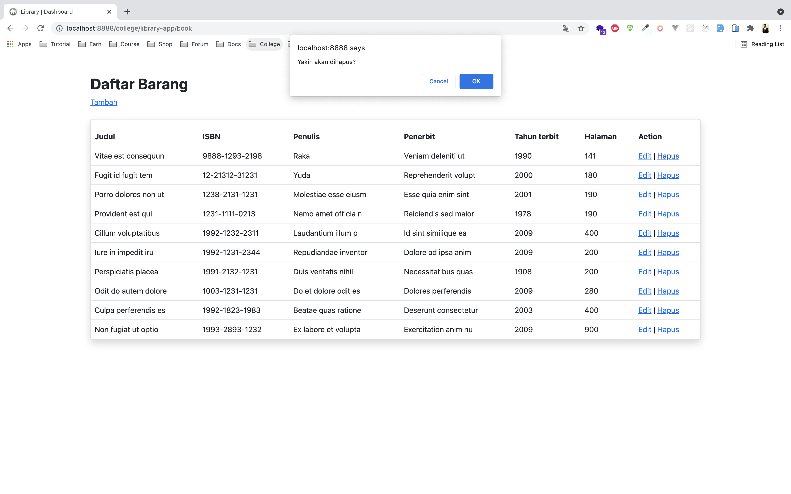
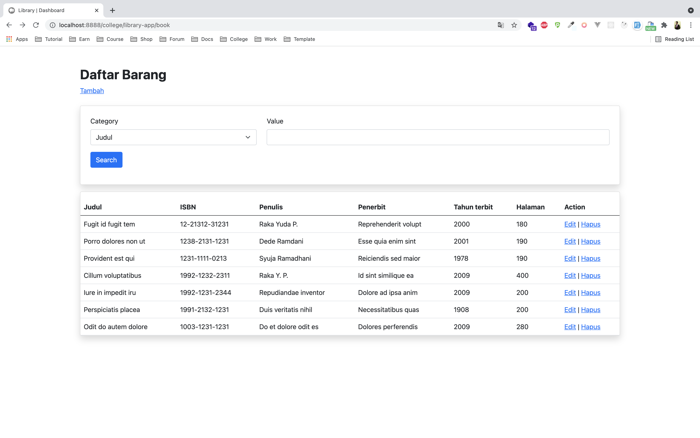
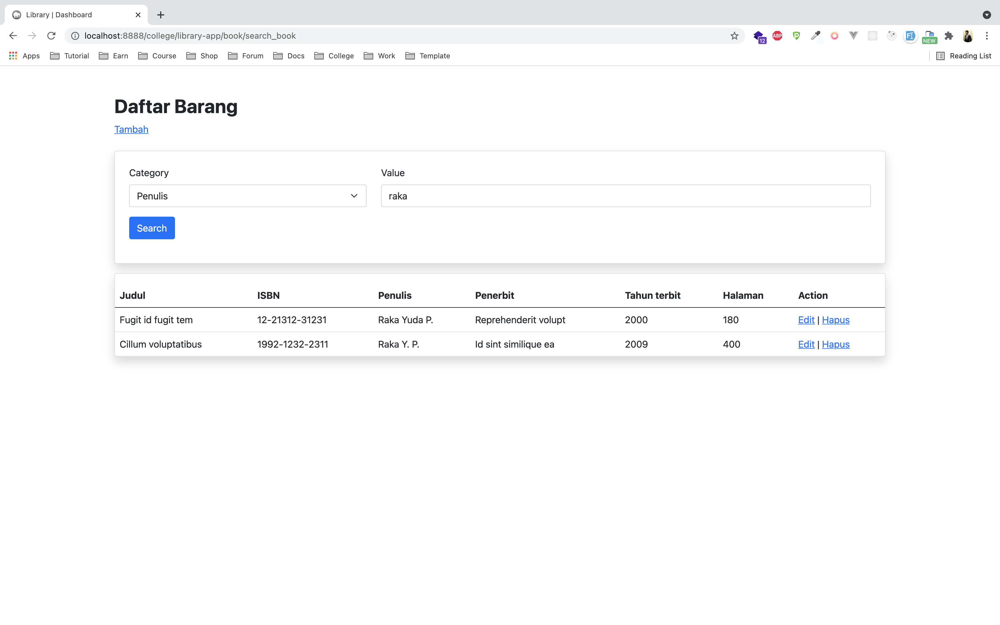

## Simply crud project built with CodeIgniter and SQLite

---

Latest updated :

- Add new route (/user) dashboard
- Implement export function
  

---

- Add new route (/stock) dashboard implement ajax jquery for request
  
  
  
  

---

## Add feature search

---

